# Product Requirement Document (PRD)
## Portal Publik & Dashboard Admin Desa Karangtirta (Desa Pesisir & Bahari)

**Versi**: 1.1 (Maritime Specialization Update)  
**Tanggal**: 13 Agustus 2026  
**Karakteristik Desa**: Desa Bahari / Pesisir / Nelayan & Potensi Kemaritiman  
**Target Sistem**: Web-Based Application (Responsive Desktop, Tablet, Mobile)

---

## 1. Ringkasan Eksekutif & Visi Produk

### 1.1 Latar Belakang & Identitas Desa
Desa Karangtirta merupakan desa pesisir berkarakteristik **Desa Bahari / Nelayan** yang berfokus pada aktivitas masyarakat pesisir, Tempat Pelelangan Ikan (TPI), perdagangan komoditas laut, serta pelestarian ekosistem pantai dan konservasi mangrove. Platform digital terpadu ini dirancang khusus untuk memenuhi kebutuhan unik warga nelayan, pengunjung/tengkulak hasil laut, serta Perangkat Desa melalui 2 (dua) portal utama:
1. **Public Portal**: Layanan publik transparan, pemantauan cuaca maritim & tinggi gelombang, jadwal pelelangan ikan (TPI), katalog UMKM pesisir, dan laporan konservasi mangrove.
2. **Admin Dashboard**: Panel manajemen internal Perangkat Desa untuk pengelolaan data kependudukan (nelayan & umum), validasi UMKM produk laut, balasan laporan warga, dan ekspor pelaporan dinas.

### 1.2 Visi Produk
> *"Mewujudkan Desa Karangtirta sebagai desa pesisir digital yang mandiri, sejahtera, dan lestari melalui optimalisasi ekonomi bahari, transparansi informasi maritim, serta pelayanan publik terpadu."*

---

## 2. Target Pengguna & Persona

| Persona | Peran | Kebutuhan Utama | Ekspektasi Layanan |
| :--- | :--- | :--- | :--- |
| **Nelayan & Warga Pesisir** | Pengguna Publik | Mengecek info cuaca laut & tinggi gelombang, melihat jadwal TPI & estimasi harga lelang ikan, laporan pengaduan pesisir, dan info bantuan nelayan. | Responsif di ponsel, warna kontras tajam (mudah dibaca di bawah terik matahari), cepat. |
| **Tengkulak / Pembeli Hasil Laut & Wisatawan** | Pengguna Publik | Mengecek hasil lelang ikan TPI, katalog UMKM olahan laut, lokasi dermaga/peta konservasi mangrove, serta profil desa. | Peta interaktif jelas, jadwal TPI ter-update, kontak UMKM langsung via WhatsApp. |
| **Perangkat Desa & Pengelola TPI/Admin** | Pengelola Sistem | CRUD Data Kependudukan (Warga/Nelayan), update status TPI & laporan cuaca, balasan pengaduan, validasi UMKM, dan Export CSV untuk pelaporan dinas kelautan. | Tabel cepat, sistem pencarian NIK/KK akurat, ekspor data CSV sekali klik, proteksi login aman. |

---

## 3. Spesifikasi Fitur Detail

```mermaid
graph TD
    Root[Portal Desa Karangtirta Bahari] --> Public[3.1 Public Portal]
    Root --> Admin[3.2 Admin Dashboard]

    Public --> P1[Beranda - Hero & Weather Widget]
    Public --> P2[Profil & Peta Interaktif Pesisir]
    Public --> P3[Informasi Maritim & Jadwal TPI]
    Public --> P4[Konservasi Mangrove & Ekosistem]
    Public --> P5[Aparat Pemerintahan]
    Public --> P6[Statistik Demografi & Pekerjaan Nelayan]
    Public --> P7[Berita & Mading Digital Pesisir]
    Public --> P8[Katalog UMKM Olahan Laut]
    Public --> P9[Simulasi Live CCTV Dermaga/Pesisir]
    Public --> P10[Layanan Pengaduan Warga]

    Admin --> A1[Autentikasi Terpusat]
    Admin --> A2[Dashboard Overview Smart Panel]
    Admin --> A3[Manajemen Kependudukan - Warga CRUD]
    Admin --> A4[Manajemen Pemerintahan - Aparat CRUD]
    Admin --> A5[Manajemen Laporan & Balasan]
    Admin --> A6[Manajemen UMKM & Komoditas Laut]
    Admin --> A7[Ekspor Data CSV Terintegrasi]
```

---

### 3.1 Public Portal (Warga & Umum)

#### 3.1.1 Beranda (Hero Section & Weather Banner)
* **Deskripsi**: Halaman utama bertema bahari dengan latar estetika pesisir pantai, mengintegrasikan widget cuaca maritim dan akses cepat ke layanan desa.
* **Komponen & Fitur**:
  * **Hero Maritime Banner**: Headline sambutan hangat Kepala Desa Karangtirta dengan pemandangan pesisir, CTA "Lihat Jadwal TPI", "Cek Cuaca Laut", dan "Lapor Pengaduan".
  * **Widget Cuaca Maritim Ringkas**: Banner indikator cepat untuk Nelayan (Suhu air, Kecepatan Angin, dan Status Keamanan Melaut: `Aman / Waspada / Bahaya`).
  * **Quick Stats Counter**: Total Jiwa, Jumlah Nelayan Aktif, Rekap Hasil Tangkapan TPI (Ton/Bulan), Luas Hutan Mangrove, dan Total UMKM Pesisir.

#### 3.1.2 Profil & Peta Interaktif Pesisir
* **Deskripsi**: Menyajikan sejarah desa nelayan, visi misi, potensi kemaritiman, serta peta lokasi penting di wilayah pesisir.
* **Komponen & Fitur**:
  * **Tab Narasi**: Sejarah Karangtirta sebagai desa nelayan tradisional, Visi Misi Kelautan, dan Nilai Budaya Kemaritiman (Petik Laut/Sedekah Laut).
  * **Peta Interaktif Pesisir (Interactive Coastal Map)**:
    * Marker Lokasi Penting: Balai Desa, Tempat Pelelangan Ikan (TPI), Dermaga Nelayan, Titik Konservasi Mangrove, Pos Monitoring CCTV Pesisir, dan Sentra Olahan Kerupuk/Ikan Asin.
    * Popup info detail: Koordinat, foto lokasi, status operasional, dan rute.

#### 3.1.3 Informasi Maritim & Jadwal Pelelangan Ikan (TPI)
* **Deskripsi**: Modul khusus aktivitas pesisir untuk memberikan data navigasi nelayan dan transaksi pelelangan ikan.
* **Komponen & Fitur**:
  * **Informasi Cuaca Maritim & Tinggi Gelombang**:
    * Tinggi Gelombang Laut (meter), Kecepatan & Arah Angin (Knot), Kelembapan, serta Pasang Surut Air Laut.
    * Status Peringatan Dini Cuaca Laut dari BMKG (Indikator warna: Hijau = Aman, Kuning = Waspada, Merah = Bahaya).
  * **Jadwal & Catalog Tempat Pelelangan Ikan (TPI)**:
    * Jadwal Sesi Lelang Harian (Pagi/Sore).
    * Daftar Komoditas Utama Tangkapan Hari Ini (Tongkol, Tenggiri, Kakap, Udang, Kepiting, Cumi).
    * Estimasi Pergerakan Harga Lelang per Kg.

#### 3.1.4 Program Konservasi Mangrove & Ekosistem Pesisir
* **Deskripsi**: Transparansi kegiatan pelestarian lingkungan pantai dan rehabilitasi ekosistem bahari Karangtirta.
* **Komponen & Fitur**:
  * **Laporan Penanaman Mangrove**: Grafik total bibit mangrove ditanam, luas area rehabilitasi, dan peta zona hijau pesisir.
  * **Jadwal Aksi Bersih Pantai (Beach Clean-Up)**: Pengumuman kegiatan gotong royong warga nelayan dan sukarelawan.
  * **Edukasi Ekosistem**: Panduan perlindungan terumbu karang dan fauna pesisir yang dilindungi.

#### 3.1.5 Aparat Pemerintahan (Hierarki Transparan)
* **Deskripsi**: Struktur hierarki pejabat desa termasuk Urusan Kemaritiman & Kelautan Desa.
* **Komponen & Fitur**:
  * Hierarchy Cards: Kepala Desa, Sekdes, Kaur Keuangan/Pembangunan, Kasi Cipta Karya & Kemaritiman, hingga Kepala Dusun Pesisir.
  * Kartu profil pejabat lengkap foto, jabatan, dan jadwal pelayanan warga.

#### 3.1.6 Statistik Demografi (Termasuk Data Profesi Nelayan)
* **Deskripsi**: Visualisasi interaktif demografi warga dengan penekanan pada komposisi profesi nelayan dan pembudidaya laut.
* **Komponen & Fitur**:
  * Visualisasi Populasi: Gender, Usia, Pendidikan.
  * Distribution Profesi Pesisir: Nelayan Tangkap, Pembudidaya Tambak, Pengolah Hasil Laut, Pedagang Ikan, dan Profesi Non-Bahari.
  * Kepemilikan Kapal/Perahu & Alat Tangkap Warga.

#### 3.1.7 Berita & Informasi Publik (Mading Digital)
* **Deskripsi**: Papan pengumuman digital desa dengan dukungan fallback image jika berita tidak menyertakan foto.
* **Komponen & Fitur**: Grid berita kegiatan pesisir, pengumuman kuota solar nelayan, transparansi APBDes, serta pencarian kategori.

#### 3.1.8 Katalog UMKM Olahan Laut & Hasil Pesisir
* **Deskripsi**: Etalase promosi produk olahan ikan, kerajinan kerang, dan kuliner khas Karangtirta.
* **Komponen & Fitur**:
  * Kategori Khusus: Olahan Ikan & Seafood, Terasi & Ikan Asin, Kerajinan Pesisir, Kuliner Pantai, Jasa Sewa Perahu Wisata.
  * Filter & Search Bar + Direct Button WhatsApp Pemilik UMKM.
  * Badge "Terverifikasi Pemdes Karangtirta".

#### 3.1.9 Simulasi Live CCTV Pesisir & Keamanan Pantai
* **Deskripsi**: Pemantauan langsung kondisi dermaga, TPI, dan pintu muara sungai/pantai.
* **Komponen & Fitur**:
  * Stream Grid: "CCTV 01 - Dermaga TPI Utama", "CCTV 02 - Muara Pesisir Karangtirta", "CCTV 03 - Pos Monitoring Mangrove".
  * Overlay Timestamp real-time, status koneksi, dan tombol Fullscreen.

#### 3.1.10 Layanan Pengaduan & Aspirasi Warga
* **Deskripsi**: Form laporan permasalahan lingkungan laut, infrastruktur dermaga, atau pencemaran.
* **Komponen & Fitur**: Form laporan online, opsi Anonim, Generator Kode Tiket Unik (`KRT-202608-xxxx`), dan fitur Cek Status Tiket Laporan.

---

### 3.2 Admin Dashboard (Perangkat Desa)

#### 3.2.1 Autentikasi Terpusat
* Form Login terproteksi untuk Perangkat Desa & Pengelola TPI.

#### 3.2.2 Dashboard Overview (Maritime Smart Panel)
* **Metric Cards**: Total Penduduk & Jumlah Nelayan, Rekap Sesi Lelang TPI, Status Cuaca Maritim Terbaru, Rekap Laporan Warga, dan Status CCTV Pesisir.

#### 3.2.3 Manajemen Kependudukan (Warga & Nelayan CRUD)
* Tabel Penduduk dengan penanda status Nelayan/Non-Nelayan, NIK Masking (keamanan privacy), Jenis Alat Tangkap, Status BPJS Ketenagakerjaan/Kesehatan, dan fitur pencarian/filter cepat.

#### 3.2.4 Manajemen Pemerintahan (Aparat CRUD)
* Pengaturan struktur dan urutan hierarki ranking perangkat desa.

#### 3.2.5 Manajemen Laporan & Pengaduan Warga
* Penanganan laporan warga masuk, update status (`Baru`, `Diproses`, `Selesai`), dan fitur balasan admin (*admin reply*).

#### 3.2.6 Manajemen UMKM & TPI
* Moderasi pengajuan UMKM produk laut warga (*Approve* / *Reject*) dan pembaruan data harga lelang TPI.

#### 3.2.7 Export Data ke CSV / Excel
* Ekspor data instan untuk keperluan pelaporan ke Dinas Kelautan & Perikanan atau Dinas Kependudukan Kabupaten:
  * Export Data Kependudukan & Profesi Nelayan (.csv)
  * Export Rekapitulasi Laporan Warga (.csv)
  * Export Data UMKM Pesisir (.csv)
  * Export Rekap Pelestarian Mangrove & Statistik (.csv)

---

## 4. Estetika Desain & Persyaratan Non-Fungsional (NFR)

### 4.1 Palet Warna & Tema Visual (Desa Pesisir / Bahari)
* **Biru Navy (`#0A2540` / `#0F172A`)**: Digunakan sebagai warna latar belakang utama header, hero section, dan elemen struktural (Mencerminkan kedalaman laut & kesan profesional).
* **Biru Cyan (`#06B6D4` / `#0EA5E9`)**: Warna aksen untuk highlight status, button CTA, indikator aktif, dan gelombang (Mencerminkan keceriaan pesisir & air laut jernih).
* **Pasir Pantai (`#F5E6D3` / `#FEF3C7` / `#F8FAFC`)**: Warna latar kartu, kontras teks hangat, dan latar konten (Mencerminkan kehangatan pantai & kemudahan membaca).

### 4.2 Aksesibilitas (WCAG 2.2 AA Compliance)
* Kontras warna tinggi (minimal 4.5:1) aman dibaca dalam kondisi ruangan gelap maupun luar ruangan terik.
* Visible Keyboard Focus Ring pada setiap tombol dan link.
* Tag HTML5 semantik (`<nav>`, `<header>`, `<main>`, `<article>`, `<section>`, `<footer>`).

### 4.3 Data Privacy & Performance
* Masking NIK pada portal publik (`3207*************`).
* Fast Initial Load (< 1.5s) dengan optimasi lazy-load pada feed gambar dan modal.

---

## 5. Rencana Implementasi

| Fase | Fokus Pekerjaan | Komponen |
| :--- | :--- | :--- |
| **Fase 1: Foundation & Maritime Public View** | Core Layout + Palet Warna Bahari (Navy, Cyan, Sand) | Navbar, Hero dengan Weather Widget, Profil & Peta Pesisir, Navigasi. |
| **Fase 2: Feature Modules Bahari & Public** | Modul Kemaritiman & Layanan Publik | Info Cuaca & Gelombang, Jadwal TPI, Laporan Mangrove, Mading Berita, Katalog UMKM Laut, Live CCTV Dermaga, Form Lapor. |
| **Fase 3: Admin Dashboard Core & Auth** | Panel Perangkat Desa | Login Modal, Admin Layout, Overview Panel dengan Metrik Pesisir. |
| **Fase 4: Management CRUD & Export CSV** | Pengelolaan Data & Pelaporan Dinas | Warga/Nelayan CRUD, Aparat Hierarchy CRUD, Laporan Reply, Validasi UMKM, & Multi Export CSV. |
| **Fase 5: Testing & Accessibility Audit** | QA & Polish | Testing WCAG 2.2 AA, Responsivitas Mobile Pesisir, & Fine-tuning animasi. |
